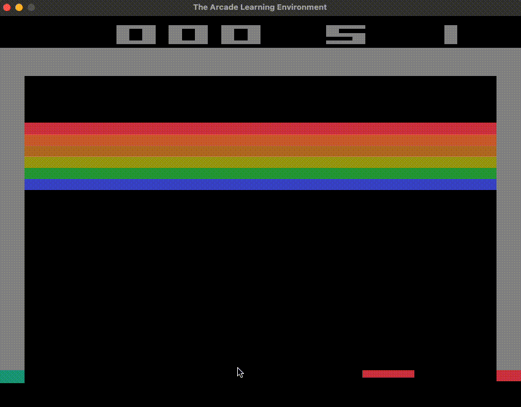

# OpenAI Breakout Gym Environment 🏋️

> Exploring OpenAI gym environment with Breakout game to learn reinforcement learning algorithms.

## Goals

Learn more about reinforcement learning algorithms.

## Results



## Running

To run the gym environment first create a new Python environment and activate it. I'm using [Anaconda](https://www.anaconda.com/) for setting the python version that pipenv should use to set up the environment. The command bellow will automatically setup the environment with conda and pipenv:

```shell
make env
```

Now install all the project dependencies:

```shell
make install-all
```

To run the game to be played by a human run:

```shell
make play
```

To run the game and run random actions run:

```shell
make sample
```
